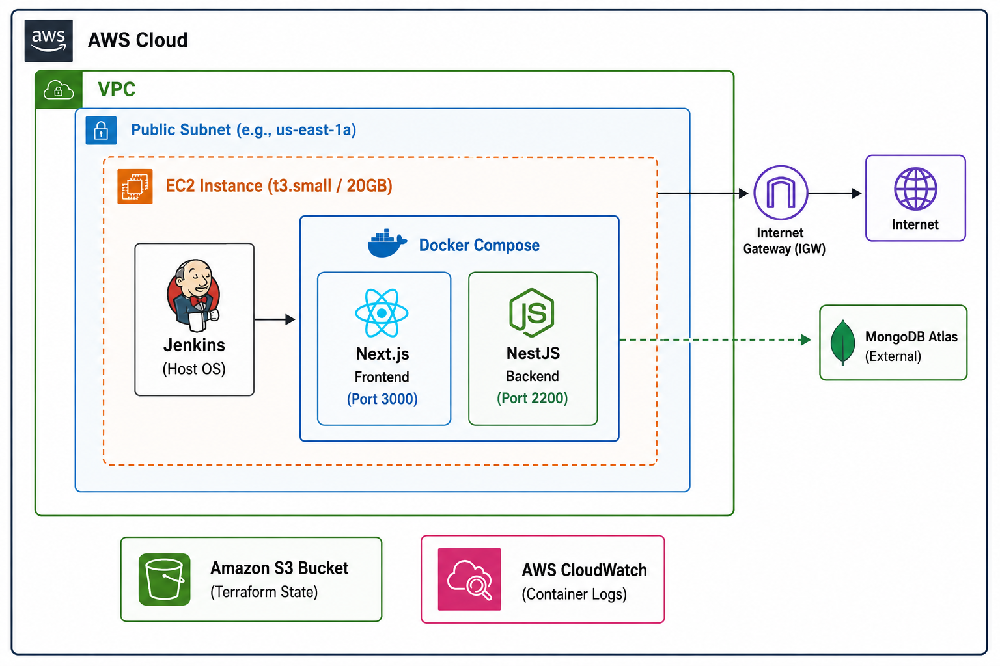

# AWS Application Deployment Project


_(Please view the `docs/` folder for the high-resolution architecture diagram)._

## 🏗️ Architecture Overview

This project implements a fully automated, cost-optimized continuous integration and continuous deployment (CI/CD) pipeline for a full-stack application consisting of a **Next.js Frontend** and a **NestJS Backend**, connected to an external MongoDB Atlas database.

The infrastructure is deployed on AWS using a single-node, multi-container architecture.

- **Compute:** A single `t3.small` EC2 instance with an expanded 20GB EBS volume handles the CI/CD orchestration (Jenkins), the build processes, and the application runtime (Docker Compose).
- **Networking:** Deployed within a custom VPC and a Public Subnet (locked to a highly-available Availability Zone), secured by a strict Security Group restricting SSH access and exposing only necessary application and CI/CD ports.
- **Container Orchestration:** Docker Compose is utilized to spin up both frontend and backend services simultaneously, handling cross-container networking and dynamic runtime variables.
- **State Management:** Terraform state is maintained remotely and securely in an Amazon S3 bucket.
- **Logging & Observability:** The application containers utilize Docker's native `awslogs` driver to stream standard output directly to isolated AWS CloudWatch Log Groups (`/devops-challenge/frontend` and `/devops-challenge/backend`) via IAM instance profiles.

---

## 🚀 Prerequisites & Initial Setup

Before deploying the infrastructure, the deployment environment must be configured.

### 1. Configure the AWS CLI

Terraform requires programmatic access to your AWS environment.

```bash
# Install the AWS CLI if not already present, then run:
aws configure
```

Provide your `AWS Access Key ID`, `AWS Secret Access Key`, default region (e.g., `us-east-1`), and output format (`json`).

---

### 2. The S3 Backend "Chicken & Egg" Resolution

To maintain production-grade state management, this project uses an S3 backend (`backend.tf`). However, Terraform cannot initialize a backend in a bucket that does not exist. To resolve this, create the bucket manually via the CLI first:

```bash
aws s3api create-bucket --bucket <your-unique-bucket-name> --region us-east-1

```

_(Ensure the bucket name in your `backend.tf` matches the one created above)._

---

## 🛠️ Infrastructure Provisioning (Terraform)

**1. Clone the repository:**

```bash
git clone <your-repository-url>
cd <repository-directory>/terraform

```

**2. Initialize and Apply:**

```bash
terraform init
terraform plan -var="allowed_ssh_ip=$(curl -s ifconfig.me)/32"
terraform apply -var="allowed_ssh_ip=$(curl -s ifconfig.me)/32"

```

_Type `yes` to approve. Wait approximately 4-5 minutes for the EC2 `user_data` script to completely install Java, Docker, and Jenkins on the host OS._

---

## ⚙️ CI/CD Configuration (Jenkins & GitHub)

Because the infrastructure is ephemeral, the initial Jenkins CI/CD pipeline requires a one-time manual bootstrap.

### 1. Unlocking Jenkins

1. Navigate to `http://<EC2_PUBLIC_IP>:8080`.
2. Retrieve the initial admin password by SSHing into the EC2 instance:

```bash
ssh -i "devops-key.pem" ubuntu@<EC2_PUBLIC_IP>
sudo cat /var/lib/jenkins/secrets/initialAdminPassword

```

3. Paste the password into the browser, select **Install suggested plugins**, and create an admin user.

### 2. Plugin & Credential Setup

1. Navigate to **Manage Jenkins -> Plugins -> Available plugins**.
2. Search for and install the **Docker Pipeline** plugin.
3. Navigate to **Manage Jenkins -> Credentials -> System -> Global credentials**.
4. Add a new **Username with password** credential. Enter your Docker Hub username and Access Token. Set the ID exactly to `docker-hub-creds`.
5. Add a new **Secret file** credential. Upload your backend `.env` file (containing your MongoDB Atlas connection string and other env values). Set the ID exactly to `backend-env-file`.

### 3. Creating the Pipeline & GitHub Webhook

1. On the Jenkins dashboard, click **New Item -> Pipeline** (name it `SpendNub-FullStack-Pipeline`).
2. Under **Build Triggers**, check **GitHub hook trigger for GITScm polling**.
3. Under **Pipeline**, set Definition to **Pipeline script from SCM**, choose **Git**, and provide the repository URL. Ensure the Script Path is `Jenkinsfile`.
4. **In GitHub:** Go to your repository **Settings -> Webhooks -> Add webhook**.
5. Set Payload URL to: `http://<EC2_PUBLIC_IP>:8080/github-webhook/`
6. Set Content Type to `application/json` and save. Any `git push` will now automatically trigger the deployment.

---

## 🧩 Infrastructure Resource Breakdown

Every resource provisioned by Terraform serves a specific architectural purpose:

- **VPC (`aws_vpc`):** Creates an isolated virtual network (`10.0.0.0/16`) for the infrastructure, providing a private boundary for the resources.
- **Internet Gateway (`aws_internet_gateway`):** Attached to the VPC, acting as the "front door" that allows resources inside the VPC to communicate with the open internet.
- **Public Subnet (`aws_subnet`):** A carved-out block of IPs (`10.0.1.0/24`) within the VPC. Set to auto-assign public IPs so the EC2 instance is reachable from the outside.
- **Route Table (`aws_route_table`):** The network's GPS. It contains a rule directing all outbound internet traffic (`0.0.0.0/0`) specifically to the Internet Gateway.
- **Route Table Association (`aws_route_table_association`):** The critical link that explicitly attaches the Route Table to the Subnet, officially converting it from a "blind" private subnet into a Public Subnet.
- **Security Group (`aws_security_group`):** The virtual firewall. It exposes Port `8080` (Jenkins UI), Port `3000` (Next.js Frontend), and Port `2200` (NestJS Backend API) to the world, but strictly limits Port `22` (SSH) to the developer's specific IP address.
- **IAM Role & Instance Profile:** Grants the EC2 instance the necessary permissions to securely push Docker container logs directly to AWS CloudWatch without hardcoded AWS keys.
- **EC2 Instance (`aws_instance`):** A `t3.small` compute node. The EBS volume has been expanded to **20GB** to easily accommodate Next.js build caching and Docker image layers without encountering disk space limits.

---

## 🧠 Design Decisions

- **Dynamic Environment Routing:** Next.js requires API URLs at _build time_, while NestJS requires CORS URLs at _runtime_. The pipeline dynamically queries the ephemeral EC2 public IP (`curl -s ifconfig.me`) during execution. It injects the IP into the Next.js Docker build using `--build-arg`, and injects it into the NestJS runtime using exported bash variables and `docker-compose`.
- **Zero-Trust Secrets Management:** The `.env` file containing the database connection string and other values are never committed to GitHub. It is vaulted inside Jenkins and injected into the pipeline purely at the moment of deployment. The pipeline executes `docker compose up -d` and immediately deletes the physical `.env` file from the server using `rm -f`, ensuring secrets only exist in container memory.
- **Host-Native Jenkins & Orchestration:** Installed Jenkins directly on the Ubuntu host OS alongside the Docker Compose plugin. This allows the pipeline to execute multi-container builds natively, avoiding the security and networking complexities of Docker-in-Docker (DinD).
- **Cost-Optimized Registry:** Docker Hub was explicitly chosen over AWS ECR to eliminate ongoing registry storage costs while keeping the images accessible for the deployment pipeline.

---

## 📌 Assumptions Made

- **HTTP Testing:** Assumed the application test will directly be via HTTP. HTTPS/ACM certificate validation and domain registration were omitted to maintain deployment velocity within the project timeframe.
- **AWS Region:** Assumed `us-east-1` as the default deployment region.
- **Ephemeral Architecture:** Assumed this infrastructure is for evaluation purposes; therefore, teardown speed and fully automated recovery are prioritized.

---

## 🔮 Limitations & Future Improvements

To transition this project architecture into a strict enterprise-grade production environment, the following improvements would be implemented:

1. **Private Subnets & ALBs:** Move the EC2 instance into a Private Subnet. Expose the application via an Application Load Balancer (ALB) in the Public Subnet to terminate SSL/TLS and prevent direct internet access to the compute node.
2. **Elastic IPs:** Currently, the EC2 instance utilizes an ephemeral public IP. If the instance is replaced via Terraform, the IP changes, requiring a manual update to the GitHub Webhook. Provisioning an Elastic IP (EIP) or using Route53 DNS records would stabilize the CI/CD trigger and remove the need for dynamic IP injection during builds.
3. **High Availability:** Migrate the workload from a single node to an Auto Scaling Group (ASG) or an ECS Fargate cluster distributed across multiple Availability Zones.
